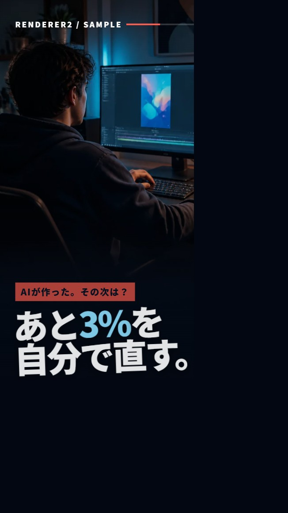

# RENDERER2

> Turn CDE2 and compatible HTML motion-design decks into deterministic MP4 video—locally.

[日本語](#日本語) | [English](#english)



## 日本語

RENDERER2は、[CDE2](https://github.com/phrase00-sketch/cde2)で仕上げたZIP / HTMLデッキを、PuppeteerとFFmpegを使ってMP4へ変換するローカルレンダラーです。CSS / WAAPIアニメーション向けの高速経路と、`requestAnimationFrame`・Canvas・WebGL・タイマーをフレーム単位で進める仮想時間経路を備えています。

CDE2が「AI生成物を自分で直す編集台」なら、RENDERER2はその結果を制作動画へ変える下流工程です。GitHubが何かも知らなかった非エンジニアが、Codexと対話しながら日常の動画制作で使い続け、実際の不具合から改良してきた二つの道具を、役割と依存関係の違いから別リポジトリとして公開しています。

### 主な機能

- 複数のChromiumワーカーによる並列フレームキャプチャ
- CSS / WAAPI向けの高速シーク方式
- rAF / Canvas / WebGL / `setTimeout` 向けの決定論的な仮想時間方式
- 縦型・横型を含む任意のステージサイズ検出
- CDE2のシーン境界、動画イン点 `data-vin`、ナレーション、BGMへの対応
- `<video data-audio="1">` と `<audio>` の音声合成
- 実行ごとに固有の一時フォルダを使う安全な並行実行
- 重いWebGLでコンテキストが失われた区間を検出し、黒いフレームを完成扱いせず自動再試行
- Windows向けのファイル選択・ZIP展開・自動判定ランチャー

### 必要なもの

- Node.js 22.12.0以上
- FFmpeg（`ffmpeg` と `ffprobe` にPATHが通っていること）
- Windows / macOS / Linux。ワンクリックランチャーだけはWindows専用です

Puppeteer用Chromiumは `npm ci` の際にダウンロードされます。

### クイックスタート

```bash
git clone https://github.com/phrase00-sketch/renderer2.git
cd renderer2
npm ci
npm run render -- "examples/sample-deck.dc.html"
```

リポジトリ直下に `deck.mp4` が作成されます。サンプルは生成画像だけを使った12秒・4シーンの縦型デッキです。

Windowsでは `renderer2-windows.bat` をダブルクリックすると、ZIPまたはHTMLを選んで保存先を指定できます。CDE2の「RENDERER2用ZIP」はこのランチャーへそのまま渡せます。macOS / LinuxではZIPを任意のフォルダへ展開し、パッケージ内の `.dc.html` を上記コマンドへ渡してください。

### 書き出し方式

通常は高速なCSS方式です。

```bash
npm run render -- "path/to/deck.dc.html"
```

Canvas、WebGL、rAF、タイマーを使うデッキは仮想時間方式を使います。

```bash
npm run render:vt -- "path/to/deck.dc.html"
```

Windowsランチャーは `data-render-mode="css|vt"` の明示指定を優先し、指定がなければデッキ本体と同一パッケージ内のローカルスクリプトから自動判定します。通常のCSS / VTデッキも、Three.jsや重いWebGLを検出したVTデッキも、まず4並列でキャプチャします。重いWebGLで区間が失敗した場合や、ブラウザがWebGLコンテキスト喪失を報告した場合は、成功済みフレームを残したまま失敗区間だけを最大2並列、最後に1並列＋長い通信待ち時間で段階的に再試行します。全ワーカーが最初のフレームを100秒間作れない段階は早期終了し、4並列と2並列の両方が起動停止した場合は、デッキ全体を1ブラウザへ統合して再試行します。4並列で完走するデッキには再試行の待ち時間は加わりません。

### 主な設定

環境変数で調整できます。既定値は `CONC=4`、`FPS=30`、`CRF=16`、`FORMAT=jpeg`、`JPEG_Q=92`、`PORT=8800`、`OUT=deck.mp4` です。

- `CONC`: コマンドライン実行時の初回並列ワーカー数（1〜32）
- `RENDERER2_CONC`: Windowsランチャーの初回並列数を手動上書き（1〜32）。重いWebGLでは `1`、`2`、`4` を選ぶと、それぞれ1並列、2→1、4→2→1で動作
- `FPS`: 出力フレームレート（1〜120）
- `CRF`: H.264画質（0〜51。小さいほど高画質）
- `PRESET`: FFmpeg / libx264プリセット（例: `veryfast`）
- `OUT`: 出力MP4のパス
- `VT=1`: 仮想時間方式
- `NOAUDIO=1`: すべての音声合成を無効化
- `VIDAUDIO=1|0`: すべての動画音声を強制ON / OFF
- `KEEP_FRAMES=1`: 診断用に中間フレームを残す
- `PROTO_TIMEOUT`: 各ワーカーのPuppeteer通信制限時間（ミリ秒）
- `STARTUP_STALL_TIMEOUT`: 重いWebGLの複数ワーカー段階で最初のフレームを待つ時間（既定100000ミリ秒、`0`で無効）
- `RETRY_PROTO_TIMEOUT`: 最終1並列再試行時の通信制限時間（既定300000ミリ秒）
- `RETRY_FAILED_SHARDS=0`: 失敗区間だけの段階的な自動再試行を無効化
- `PUPPETEER_EXECUTABLE_PATH`: 既存Chrome / Chromiumを使う場合の実行ファイル

現在の最終エンコードはGPUエンコーダーではなくFFmpegの `libx264` を使います。速度はCPU、ストレージ、Chromiumキャプチャ、並列数の影響を受けます。

### デッキ互換性

RENDERER2は、`BOUNDS = [...]`、`duration = ...`、タイムライン用range input、またはCDE2互換のシーン構造を持つHTMLを想定しています。動画素材の小さな開始位置調整には `<video data-vin="秒">` を使います。素材の残り尺がシーン尺以上であることを確認してください。

パッケージ固有の `support.js` や `image-slot.js` は本リポジトリに含めていません。必要な場合は、利用・再配布条件を確認したうえで入力パッケージ側に含めてください。

### セキュリティ

デッキのJavaScriptはローカルのChromium内で実行され、外部URLへ通信する場合があります。自分で作成したもの、または信頼できる提供元のパッケージだけをレンダリングしてください。RENDERER2自体にアップロード用サーバーはなく、ローカル素材サーバーは `127.0.0.1` に限定されます。詳細は [SECURITY.md](SECURITY.md) を参照してください。

## English

RENDERER2 is a local Puppeteer + FFmpeg renderer for ZIP / HTML decks finished in [CDE2](https://github.com/phrase00-sketch/cde2) and compatible motion-design workflows. It provides a fast CSS / WAAPI path and a deterministic virtual-time path for `requestAnimationFrame`, Canvas, WebGL, and timer-driven animation.

If CDE2 is the editing desk where an AI-generated result is finished by hand, RENDERER2 is the downstream step that turns it into production video. The two tools grew from daily use by a non-engineer creator working in dialogue with Codex. They are published separately because their responsibilities, dependencies, and security surfaces differ.

### Highlights

- Parallel capture through multiple Chromium workers
- Fast CSS / WAAPI animation seeking
- Deterministic virtual-time capture for rAF, Canvas, WebGL, and timers
- Automatic portrait, landscape, and custom stage-size detection
- CDE2 scene boundaries, `data-vin`, narration, and BGM support
- Audio composition from `<video data-audio="1">` and `<audio>` elements
- Unique per-run temporary frame directories
- WebGL context-loss detection so visually broken shards retry instead of passing as black output
- Optional Windows launcher for ZIP extraction, mode detection, and output selection

### Requirements and quick start

- Node.js 22.12.0 or newer
- FFmpeg with both `ffmpeg` and `ffprobe` available on PATH
- Windows, macOS, or Linux; the graphical launcher is Windows-only

```bash
git clone https://github.com/phrase00-sketch/renderer2.git
cd renderer2
npm ci
npm run render -- "examples/sample-deck.dc.html"
```

This creates `deck.mp4` in the repository root. The included 12-second portrait sample uses only synthetic, generated imagery.

Use the virtual-time path for Canvas, WebGL, rAF, or timer-driven decks:

```bash
npm run render:vt -- "path/to/deck.dc.html"
```

On Windows, double-click `renderer2-windows.bat` to select a CDE2 renderer ZIP or HTML deck. The launcher inspects the deck and local scripts inside the same package. Heavy Three.js / WebGL virtual-time decks start with four Chromium workers. If a capture shard fails or reports a lost WebGL context, completed frames remain in place while only failed shards step down to at most two workers, then one worker with a longer protocol timeout. A multi-worker stage that produces no first frame for 100 seconds exits early; if every worker stalls at both four and two workers, the final retry captures the full deck in one browser instead of paying four separate browser startups. Decks that complete at four workers pay no retry cost. Standard CSS and virtual-time decks retain the four-worker default and sequential failed-shard retry. On macOS and Linux, extract a ZIP and pass its `.dc.html` file to the command above.

The main environment variables are `CONC`, `FPS`, `CRF`, `FORMAT`, `JPEG_Q`, `PRESET`, `OUT`, `VT`, `NOAUDIO`, `VIDAUDIO`, `KEEP_FRAMES`, `PROTO_TIMEOUT`, `STARTUP_STALL_TIMEOUT`, `RETRY_PROTO_TIMEOUT`, `RETRY_FAILED_SHARDS`, and `PUPPETEER_EXECUTABLE_PATH`. `CONC` sets the initial command-line worker count; set `RENDERER2_CONC=1..32` to override the Windows launcher. For heavy WebGL, choosing 1, 2, or 4 produces a 1, 2→1, or 4→2→1 path. `STARTUP_STALL_TIMEOUT` defaults to 100000 milliseconds for heavy WebGL multi-worker stages and accepts `0` to disable the startup watchdog. The current final encoding path uses FFmpeg `libx264`, so export speed depends on CPU, storage, browser capture, and concurrency rather than GPU encoding alone.

Deck JavaScript runs inside local Chromium and may make network requests. Render only packages you created or trust. See [SECURITY.md](SECURITY.md), [THIRD_PARTY.md](THIRD_PARTY.md), and [CONTRIBUTING.md](CONTRIBUTING.md).

## Project status

This is the first public release of a renderer actively used in a private production workflow. The public repository contains only the renderer, documentation, and synthetic sample assets—no production footage, audio, logs, backups, or package runtimes with unclear redistribution provenance.

RENDERER2 is an independent community project and is not affiliated with or endorsed by OpenAI, Anthropic, Google, the Chromium project, or the FFmpeg project.

## Validation

Run the syntax checks and real half-second MP4 smoke renders:

```bash
npm run check
npm run test:adaptive
npm test
npm run test:vt
```

## License

MIT. See [LICENSE](LICENSE).
